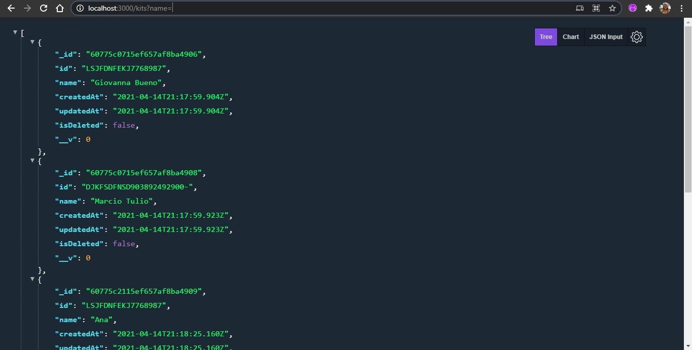
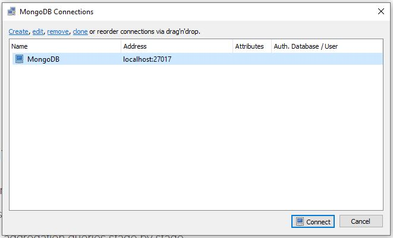
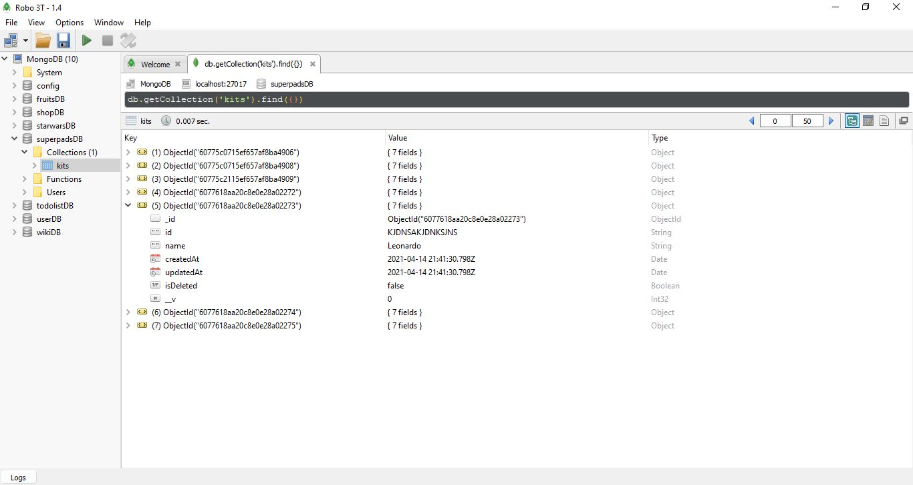

# API Rest

## *Desafio Backend Node.js*
O desafio consiste em criar uma API RESTful utilizando o express para gerenciar kits do Super Pads (aplicativo que permite criar músicas usando botões coloridos). 

## *Kit*
| Campo | Tipo |
|-------|------|
| id | String |
| name | String |
| createdAt | date |
| updatedAt | date |
| isDeleted | boolean |
| | |

## *Requisitos*
- Ao criar um novo kit os campos createdAt e updatedAt devem ser salvos com o horário atual da operação.
- Ao criar um novo kit o campo isDeleted deve ser salvo como false por padrão.
- Ao atualizar um kit o campo updatedAt deve ser atualizado com o horário atual da operação.
- Ao buscar os kits deve ser retornado apenas os kits marcados como isDeleted igual à false.
- Ao excluir um kit o campo isDeleted deve ser marcado como true.

## *Rotas*

### **POST/kits**
Esse método deve criar um novo kit.

### **PUT/kits/:id**
Alterar um kit por id.

### **GET/kits?name=**
Buscar todos os kits ou filtrar os kits por nome.

### **GET/kits/:id**
Buscar um kit por id.

### **DELETE/kits/:id**
Excluir um kit por id.

### **GET/kits/fetch?timestamp=0**
Buscar todos os kits que foram criados ou atualizados após o timestamp recebido como parâmetro. Se o timestamp for 0 não pode retornar os kits marcados com excluídos. Se o timestamp for maior que 0 deve retornar também os kits excluídos após o valor do timestamp.

## *Tecnologias Usadas* 

### **Google Chrome**
- Browser.

- Versão 89.0.4389.114

- [Download do Google Chrome](https://www.google.com/intl/pt-BR/chrome/)

- Como instalar: `Windows, Mac e Linux ` [Suporte da Google](https://support.google.com/chrome/answer/95346?co=GENIE.Platform%3DDesktop&hl=pt-BR)

- Extensões usadas: **JSON Viewer Pro**, Versão 1.0.1

### **Visual Studio Code** 
- Editor de código-fonte. 

- Versão 1.55.0

- [Download do Visual Studio Code](https://code.visualstudio.com/download)  

- Como instalar: `Baixe e execute o instalador (dê preferência ao de 64 bits se seu Windows suportar). Avance todas as etapas do instalador até concluir a instalação e abra o Visual Studio Code.` [Instalação VSCode](https://balta.io/blog/visual-studio-code-instalacao-customizacao)

- Extensões usadas: **Better Comments** by Aaron Bond, Versão 2.1.0

### **Git Bash**
- Aplicativo para ambientes do Microsoft Windows. Aplicativo terminal usado como interface em sistemas operacionais por meio de comandos gravados. 

- Versão 2.30.1.windows.1

- [Download do Git](https://git-scm.com/downloads) 

- Como instalar: `Após o instalador ser baixado, execute-o. Avance todas as etapas de acordo com suas preferências e clique em 'Install' para começar a instalação.` [Instalação do Git](https://www.hostinger.com.br/tutoriais/tutorial-do-git-basics-introducao#:~:text=Instalar%20o%20GIT%20no%20Windows%3A&text=Acesse%20o%20site%20oficial%20e,concluir%20com%20%C3%AAxito%20a%20instala%C3%A7%C3%A3o.)

### **Node.js**
- Software multiplataforma que executa códigos Javascript no servidore interface. 

- Versão 14.13.0

- [Download do Node.js](https://nodejs.org/en/)

- Como instalar: `Baixe e execute o instalador, avançando todas as etapas. Por fim, abra uma janela de comandos e digite 'node -v' para conferir a versão do seu Node.js ` [Instalação do Node.js](https://medium.com/@adsonrocha/como-instalar-o-node-js-no-windows-10-cf2bd460b8a8)

### **npm**
- Gerenciador de pacotes para Javascript. 

- Versão 7.5.2

- [Download do npm](https://nodejs.org/en/) (Quando instalamos o Node.js, o npm também já é instalado no mesmo pacote)

- Como instalar: `Mesmas instruções para a instalação do Node.js` 

### **Postman**
-  Ferramenta de interface de usuário que permite realizar solicitações HTTP

- Versão 8.1.0

- [Download do Postman](https://www.postman.com/downloads/)

- Como instalar: `Após realizar o download, execute o instalador. Crie uma conta para que suas requisições fiquem salvas na núvem.` [Instalação do Postman](https://atendimento.tecnospeed.com.br/hc/pt-br/articles/360017143594-Como-instalar-e-utilizar-o-Postman-para-enviar-requisi%C3%A7%C3%B5es-HTTP)

### **MongoDB**
- Banco de Dados Não-Relacional

- Versão 4.4

- [Download do MongoDB](https://www.mongodb.com/try/download/community)

- Como instalar: [Instalação do MongoDB](https://medium.com/@LondonAppBrewery/how-to-download-install-mongodb-on-windows-4ee4b3493514)
    1. `Assim que o download estiver completo, execute o instalador e avance todas as etapas. `
    2. `Cheque se na pasta 'C:\Program Files\' existe uma pasta chamada 'MongoDB'. `
    3. `Vá ao diretório raiz C:\ e crie uma pasta chamada 'data'. Dentro da pasta 'data', crie uma outra pasta chamada 'db'. `
    4. `Volte na pasta de caminho 'C:\Program Files\MongoDB' e entre na pasta 'Server'. Dentro dela, terá outra pasta com nomeação de um número. Esse número é a versão do seu MongoDB. Guarde esse número.`
    5. `Iremos criar um atalho para o 'mongo.exe' e 'mongod.exe' usando o nosso terminal.`
    6. `Vá ao terminal e mude o diretório para o diretório raiz.`
    ~~~markdown
    cd ~
    ~~~
    7. `Crie um novo arquivo chamado '.bash_profile'.`
    ~~~markdown
    touch .bash_profile
    ~~~
    8. `Vamos editar esse arquivo utilizando o editor de texto 'Vim' baseado em linha de comando.`
    ~~~markdown
    vim .bash_profile
    ~~~
    9. `Dentro do 'Vim', clique a tecla 'i' para entrar no 'Insert Mode'. Copie e cole as duas seguintes linhas: (Confira a versão do seu 'MongoDB' e troque pela parte que diz '4.0')`
    ~~~markdown 
    alias mongod="/c/Program\ files/MongoDB/Server/4.0/bin/mongod.exe"
    alias mongo="/c/Program\ Files/MongoDB/Server/4.0/bin/mongo.exe"
    ~~~
    10. `Clique a tecla 'esc' para SAIR do 'Insert Mode', e digite: `
    ~~~markdown
    :wq!
    ~~~
    11. `Clique ENTER e automaticamente você já saiu do 'Vim'.`
    12. `Feche o terminal e o abra novamente.`
    13. `Digite: `
    ~~~markdown
    mongo --version
    ~~~
    14. `Caso você veja algo como isso na tela, a instalação está completa: `
    ~~~markdown
    MongoDB shell version v4.0.3 (ou o número da sua versão)
    git version: .....
    ~~~

### **Robo 3T**
-  Software multiplataforma para gerenciamento de banco de dados MongoDB.

- Versão 1.4.3

- [Download do Robo 3T](https://robomongo.org/download)

- Como instalar: `Após o download, execute o instalador e aceite todos os termos. ` [Instalação do Robo 3T](https://www.youtube.com/watch?v=a1jQyjdoY6c)

## *Como Rodar o Código*
Assim que todas as tecnologias estiverem baixadas e instaladas corretamente, baixe o projeto do GitHub em uma pasta de sua preferência.

1. `Vá ao 'Git Bash' (ou terminal de sua preferência).`
2. `Dentro do diretório que contém o projeto, execute o seguinte código, que permite criar um novo projeto de Node.js:`
~~~markdown 
npm init
~~~
3. `Ainda no terminal, instale todos os pacotes que serão utilizados no projeto, com o seguinte código (os pacotes serão explicados em breve):`
~~~markdown
npm i express nodemon consign mongoose
~~~
~~~markdown
ou
~~~ 
~~~markdown
npm install express 
npm install nodemon
npm install consign
npm install mongoose
~~~
4. `A fim de utilizarmos o banco de dados, vamos precisar abrir mais um terminal. Nesse novo terminal, digite o seguinte código e DEIXE O TERMINAL ABERTO (não o feche nem escreva nada nele): `
~~~markdown
mongod
~~~
5. `Para reiniciar o aplicativo Node.js automaticamente caso haja alguma mudança, ainda no terminal, digite:`
~~~markdown
nodemon server.js
~~~
6. `Caso queira utilizar o método 'POST', vá ao aplicativo Postman com sua conta já logada. Selecione a opção 'POST', e ao lado, digite a rota que deseja. Em seguida, selecione a opção 'Body', 'JSON', e insira os dados desejados. `

>ATENÇÃO - No método POST os dados devem estar dentro de um array (mesmo que esteja inserindo somente um dado), assim como no exemplo a seguir:

#### **Exemplo**
~~~javascript
[
    {
        "id": "...",
        "name": "..."
    }
]
~~~

7. `Caso queira utilizar o método 'PUT', vá ao aplicativo Postman com sua conta já logada. Selecione a opção 'PUT', e ao lado, digite a rota que deseja. Em seguida, selecione a opção 'Body', 'JSON', e insira os dados desejados na qual quer mudar.`

8. `Caso queira utilizar o método 'GET', vá ao seu browser e digite http://localhost:3000/, e em seguida a rota que deseja. O resultado esperado deve ser semelhante ao da figura a seguir: `

9. `Caso queira utilizar o método 'DELETE', vá ao aplicativo Postman com sua conta já logada. Selecione a opção 'DELETE', e ao lado, digite a rota que deseja.`

10. `Para visualizar o banco de dados, abra o aplicativco 'Robo 3T' e clique em 'Connect' para conectar com o nosso banco de dados.`

11. `Procure pelo banco de dados chamado 'superpadsDB', e navegue por suas opções clicando com o botão direito do mouse.`

## *Pacotes npm*

### **express**
- Framework Node mais popular, e uma biblioteca subjacente para uma série de outros frameworks do Node. O 'express' fornece soluções para gerenciar requisições HTTP, integrar 'view engines' para inserir dados nos templates, definir configuraçôes comuns de aplicações web, e adicionar novos processos de requisição por meio de 'middleware'. 

- Versão 4.17.1

### **mongoose**
- Biblioteca do Node.js que proporciona uma solução baseada em esquemas para modelar os dados da aplicação. Fornece mapeamento de objetos do MongoDB (Banco de Dados Não-Relacional). Se encaixa na categoria de pacotes do npm.

- Versão 5.12.3

### **consign**
- Pacote que facilita o desenvolvimento de aplicativos com separaçâo lógica de arquivos e carregamento automático de scripts. Pode ser usado para carregar automaticamente modelos, rotas, esquemas, configuraçôes, controladores, mapas, entre outros.

- Versão 0.1.6

### **nodemon**
- Módulo utilitário que monitora todas as alterações nos arquivos da aplicação e reinicia automaticamente o servidor quando for necessário.

- Versão 2.0.7
